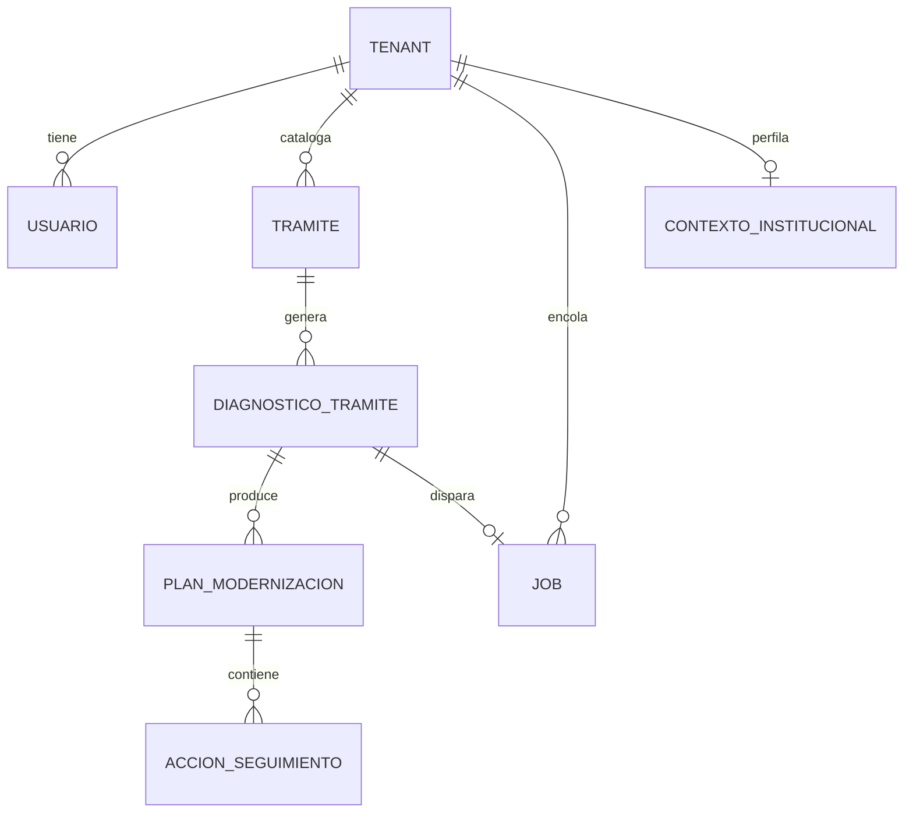

# Backend Schema — DiagMuni

Versión 1 · 21 de julio de 2026
Quinto de los 6 documentos de blueprint de producto. Define cómo se almacena y organiza toda la data: tablas, columnas, relaciones, y el flujo de autenticación — detalle exhaustivo de las entidades de alto nivel ya nombradas en `docs/PRD.md`. Toda tabla con datos de gobierno lleva `tenant_id` y política RLS, según el mecanismo ya fijado en `docs/TRD.md`.

## Diagrama de entidades



## Tablas

### `tenant`
| Columna | Tipo | Notas |
|---|---|---|
| `id` | uuid, PK | |
| `nombre` | text | Nombre del gobierno local |
| `pais` | enum(`mx`,`uy`) | Determina qué capa de parámetros normativos aplica (ver `entregables/fase-1/matriz-normativa.md`) |
| `logo_content_type` | text, nullable, CHECK ∈ {`image/png`,`image/jpeg`,`image/svg+xml`} | `NULL` = el tenant nunca subió un logo, la UI cae a mostrar `nombre`. El archivo en sí NO vive en esta fila — vive en disco (migración 0021, ver más abajo) |
| `logo_actualizado_en` | timestamptz, nullable | `NULL` hasta la primera subida; el frontend lo usa como key de invalidación de su propia caché del logo ya descargado |
| `created_at` | timestamptz | |

Sin RLS (es la tabla raíz que define el aislamiento, no tiene `tenant_id` propio).

**Logo del gobierno** (`PUT`/`GET /api/gobierno/logo`, migración 0021, `app/adaptadores/http/gobierno_logo.py`): el archivo (png/jpg/svg, tope `LOGO_MAX_BYTES`) se guarda en disco bajo el volumen `diagmuni_logos_data` (`app/adaptadores/almacenamiento/logo_storage.py`, un archivo por `tenant_id`), no como blob en Postgres — mismo criterio de single-host que `diagmuni_db_data` (`docker-compose.yml`), y evita tener que ir a la base de datos para servir un archivo que se lee mucho más de lo que se escribe. Solo `logo_content_type`/`logo_actualizado_en` viven en `tenant`. Ambos endpoints exigen sesión del propio tenant (nunca un tenant_id por URL); subir/reemplazar exige además `admin_gobierno` (`requerir_admin`), ver GET solo exige sesión autenticada porque cualquier funcionario necesita poder cargarlo en su propia UI.

### `contexto_institucional`
| Columna | Tipo | Notas |
|---|---|---|
| `id` | uuid, PK | |
| `tenant_id` | uuid, FK → tenant, **UNIQUE** | RLS; fuerza la relación 1:1 con `tenant` |
| `poblacion_total` | integer, nullable | `>= 0` si no nulo |
| `personal_total_gobierno` | integer, nullable | `>= 0` si no nulo |
| `presupuesto_tic_anual` | numeric(14,2), nullable | `>= 0` si no nulo; moneda implícita por `tenant.pais` |
| `area_tic_existe` | boolean, nullable | |
| `conectividad` | enum(`estable`,`intermitente`,`sin_conexion`), nullable | |
| `normativa_local_emitida` | boolean, nullable | |
| `autoridad_gobernanza_digital` | boolean, nullable | Única columna con `criterio_deteccion` real en `engine/reglas/` |
| `actualizado_en` | timestamptz, nullable | `NULL` hasta el primer guardado |
| `created_at` | timestamptz | |

Perfil de contexto y capacidad institucional del gobierno, 1:1 con `tenant`, capturado una sola vez por gobierno y editable en cualquier momento — contrato completo, justificación de cada columna y de la relación 1:1 en `entregables/fase-2/variables-contexto-institucional.md`.

### `usuario`
| Columna | Tipo | Notas |
|---|---|---|
| `id` | uuid, PK | |
| `tenant_id` | uuid, FK → tenant | RLS |
| `email` | text, unique por tenant | |
| `password_hash` | text | argon2 (vía `passlib`/`argon2-cffi`) — nunca bcrypt puro sin costo configurable |
| `nombre` | text | |
| `rol` | enum(`funcionario`,`admin_gobierno`) | RBAC (migración 0011): `admin_gobierno` gestiona usuarios, catálogo de trámites y salud del sistema de IA (`/api/admin/usuarios`); `funcionario` responde diagnósticos y ve planes. El primer usuario de `crear_gobierno` siempre nace `admin_gobierno`. |
| `activo` | boolean, default `true` | Alta/baja reversible de un funcionario (migración 0011). Un usuario inactivo no puede iniciar sesión y pierde acceso de inmediato en su siguiente request, no solo al expirar su JWT (`get_current_token`, `app/adaptadores/http/deps.py`). No permitido dejar a un tenant sin ningún `admin_gobierno` activo (`app/aplicacion/gestion_usuarios.py`). |
| `ultimo_login_en` | timestamptz, nullable | `NULL` = nunca inició sesión. Se actualiza en cada login exitoso (migración 0011). |
| `created_at` | timestamptz | |

### `tramite`
| Columna | Tipo | Notas |
|---|---|---|
| `id` | uuid, PK | |
| `tenant_id` | uuid, FK → tenant | RLS |
| `nombre` | text | |
| `descripcion` | text | |
| `estado` | enum(`sin_iniciar`,`en_progreso`,`diagnosticado`,`generando_plan`,`plan_listo`) | Máquina de estados de `docs/app-flow.md` |
| `created_at`, `updated_at` | timestamptz | |
| `archivado_en` | timestamptz, nullable | `NULL` = activo (default). Archivado reversible (`POST /api/tramites/{id}/archivar`/`desarchivar`) — ortogonal a `estado`, nunca se toca junto con una transición de la máquina de estados. Un trámite archivado sale del panel resumen (índice global y fecha de último diagnóstico recalculados solo sobre los activos) y de `/api/seguimiento`, sin perder ninguna fila. Migración `0004_tramite_archivado.py`. |

Índice único `(tenant_id, nombre)` — evita duplicar el mismo trámite en un gobierno, no asume catálogo compartido entre países (ver `docs/PRD.md`, riesgo "alcance de trámite MX vs UY").

**Borrado físico** (`DELETE /api/tramites/{id}`): permitido solo antes del primer envío de diagnóstico (guard por dato — `diagnostico_tramite.completado_en` — no por `estado`, que puede volver a `en_progreso` tras un plan ya generado). Con diagnóstico ya enviado existen `plan_modernizacion` versionados que nunca deben borrarse y una línea de auditoría real que quedaría huérfana — ese caso se rechaza con `409` y sugiere archivar en su lugar.

### `diagnostico_tramite`
| Columna | Tipo | Notas |
|---|---|---|
| `id` | uuid, PK | |
| `tramite_id` | uuid, FK → tramite | |
| `tenant_id` | uuid, FK → tenant | Denormalizado a propósito — RLS no debe depender de un join a `tramite` |
| `respuestas` | jsonb | Variables capturadas: documentos papel/digital, motor de pagos, firma-e, interoperabilidad, datos personales, identidad/acceso ciudadano (ver `docs/PRD.md`). Incluye además la clave opcional `aclaraciones` (objeto anidado, una entrada de texto libre por variable como máximo) — campo de apoyo del asistente de captura F1, nunca requiere migración por ser una clave nueva dentro del mismo jsonb; detalle completo, categorías de clasificación y mecanismo de confirmación humana en `entregables/fase-2/asistente-captura-f1.md` |
| `indice_madurez` | smallint (0-4) | Calculado por `engine/`, síncrono |
| `version_motor` | text | Ej. `"1.0"` — liga el diagnóstico a la versión de reglas que lo produjo (`docs/TRD.md`, versionado) |
| `completado_en` | timestamptz, nullable | Null mientras `estado = en_progreso` |
| `created_at`, `updated_at` | timestamptz | |

### `plan_modernizacion`
| Columna | Tipo | Notas |
|---|---|---|
| `id` | uuid, PK | |
| `diagnostico_tramite_id` | uuid, FK | |
| `tenant_id` | uuid, FK → tenant | RLS, denormalizado |
| `version` | int | Incrementa si el diagnóstico se corrige y se regenera (`docs/app-flow.md`) — versiones previas nunca se borran |
| `modo` | enum(`llm`,`degradado`) | Si se generó con LLM (F3) o con plantilla determinista |
| `contenido` | jsonb | Lista de brecha→acción con la estructura enriquecida completa (paso administrativo/técnico/organizacional, prerrequisitos, por qué importa, categoría de catálogo, fuente normativa — ver `docs/TRD.md`) + resumen narrativo |
| `verificado` | boolean | Resultado de F9 (verificador) antes de mostrarse — `false` bloquea la vista y reintenta, nunca se muestra un plan no verificado |
| `generado_en` | timestamptz | |

### `accion_seguimiento`
| Columna | Tipo | Notas |
|---|---|---|
| `id` | uuid, PK | |
| `plan_modernizacion_id` | uuid, FK | |
| `tenant_id` | uuid, FK → tenant | RLS, denormalizado |
| `descripcion` | text | |
| `responsable` | text | |
| `fecha_objetivo` | date | |
| `estado_semaforo` | enum(`completado`,`en_progreso`,`atrasado`) | 3 estados, ver `docs/ux-brief.md` |
| `actualizado_en` | timestamptz | |

### `job`
| Columna | Tipo | Notas |
|---|---|---|
| `id` | uuid, PK | |
| `tenant_id` | uuid, FK → tenant | RLS |
| `tipo` | enum(`generacion_plan`) | Único tipo en el MVP |
| `diagnostico_tramite_id` | uuid, FK, nullable | |
| `estado` | enum(`pending`,`running`,`done`,`failed`) | Ciclo de vida en `docs/TRD.md` |
| `intentos` | smallint, default 0 | Reintenta si queda `running` sin actualizar N minutos |
| `resultado` | jsonb, nullable | |
| `created_at`, `updated_at` | timestamptz | |

### `historial_indice_global`
| Columna | Tipo | Notas |
|---|---|---|
| `id` | uuid, PK | |
| `tenant_id` | uuid, FK → tenant | RLS |
| `indice_global` | float | Snapshot recalculado con `calcular_indice_global` (mismos trámites activos que el panel resumen) |
| `nivel_0_conteo` … `nivel_4_conteo` | integer | Cuántos de esos trámites estaban en cada nivel de la rampa (0-4) en el mismo instante (migración 0017) — alimenta la gráfica apilada, no solo el promedio |
| `creado_en` | timestamptz | |

Append-only (migración 0015, ampliada por la 0017) — un punto por cada `POST /api/tramites/{id}/diagnostico/enviar` (`app/aplicacion/historial_indice_global.py`), nunca se actualiza ni se borra. Alimenta la gráfica de tendencia apilada del panel resumen (`docs/ux-brief.md`, "2. Panel resumen"); leída por `GET /api/tramites/indice-global/historial`.

Nota de numeración: existen dos migraciones "0016" en el historial de este repo por una colisión real (`0016_tenant_credenciales_llm.py`, credenciales de IA por gobierno, ya en el árbol de trabajo antes de esta tarea, vs. lo que iba a ser esta misma migración) — se resolvió renumerando esta a 0017 con `Revises: 0016` apuntando a la de credenciales. Si algún día ves referencias a "migración 0016" para esta tabla en un comentario viejo, es la distribución por nivel — quedó en 0017.

## Políticas RLS

Todas las tablas con `tenant_id` (`usuario`, `tramite`, `diagnostico_tramite`, `plan_modernizacion`, `accion_seguimiento`, `job`, `historial_indice_global`) llevan la misma policy, mecánica ya fijada en `docs/TRD.md`:

```sql
CREATE POLICY tenant_isolation ON <tabla>
  USING (tenant_id = current_setting('app.tenant_id')::uuid);
```

Índice `tenant_id` en cada una de estas tablas — toda query pasa por ese filtro vía policy, conviene que sea barato.

## Autenticación

JWT propio (`PyJWT`/`authlib`, ver `docs/stack-tecnologico.md`), claim mínimo: `{sub: usuario_id, tenant_id, rol, exp}`. Login: `POST /api/auth/login` valida `email`+`password` contra `usuario.password_hash` (argon2), emite JWT de vida corta (sugerido 8h, una jornada laboral) sin refresh token en el MVP — al expirar, el funcionario vuelve a `/login` (ver `docs/app-flow.md`, caso especial de sesión expirada). Sin OAuth de terceros ni Llave MX/ID Uruguay como proveedor de identidad del propio DiagMuni — esas son variables que el diagnóstico *captura sobre el trámite del gobierno*, no el mecanismo de login de DiagMuni.

## Migraciones

Alembic, una migración por cambio de esquema, nunca migraciones que alteren datos de `diagnostico_tramite`/`plan_modernizacion` ya persistidos — el versionado de reglas (`version_motor`, `plan_modernizacion.version`) existe precisamente para que un cambio de reglas no reescriba diagnósticos pasados.

## Riesgos abiertos

1. ~~Un solo rol (`funcionario`)~~ — resuelto en migración 0011: `rol` ahora admite `admin_gobierno` además de `funcionario`, con panel de administración vía HTTP (`app/adaptadores/http/admin_usuarios.py`, `app/adaptadores/http/perfil_usuario.py`) y toda la lógica concentrada en `app/aplicacion/gestion_usuarios.py` (compartida con la CLI de `app/bootstrap_tenant.py`, sin segunda copia).
2. **`contenido` de `plan_modernizacion` como jsonb, no tablas normalizadas** — se eligió así porque la estructura enriquecida (paso administrativo/técnico/organizacional...) es fiel a la forma del catálogo de reglas (`docs/TRD.md`), que también es semi-estructurado. Si el piloto necesita reportar/filtrar por campo individual de la estructura (ej. "todas las acciones con categoría X"), normalizar en tablas separadas es un cambio de fase 2, no MVP.

## Documentos relacionados

`docs/PRD.md`, `docs/TRD.md`, `docs/app-flow.md`, `docs/plan-implementacion.md` (pendiente).
