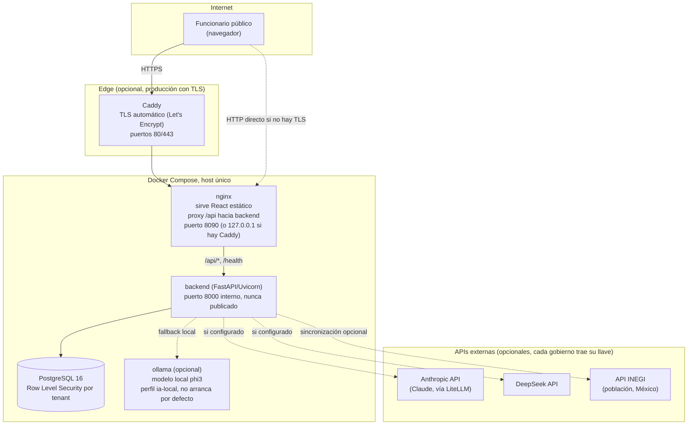
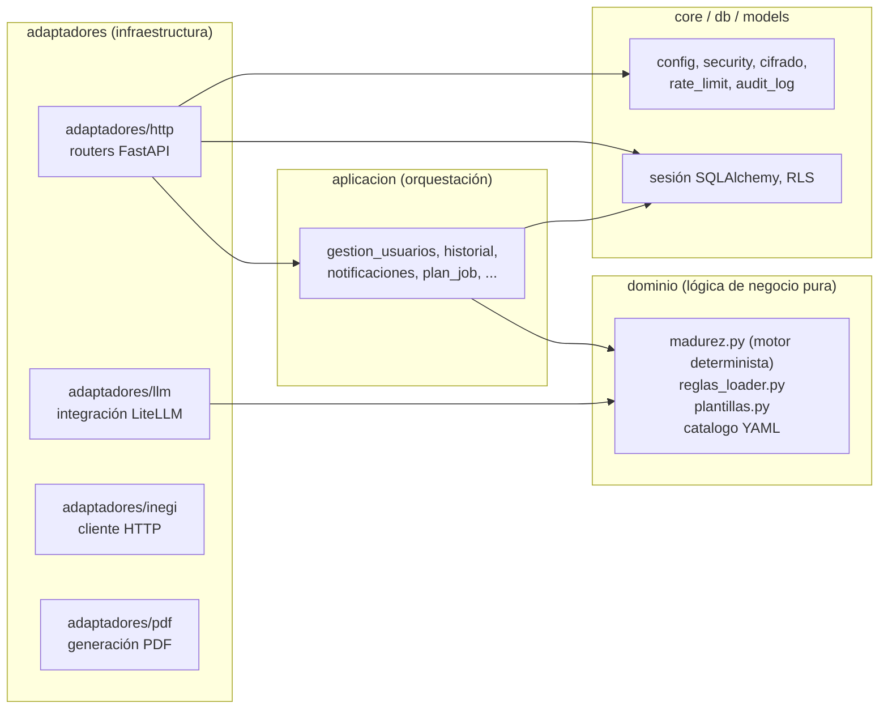
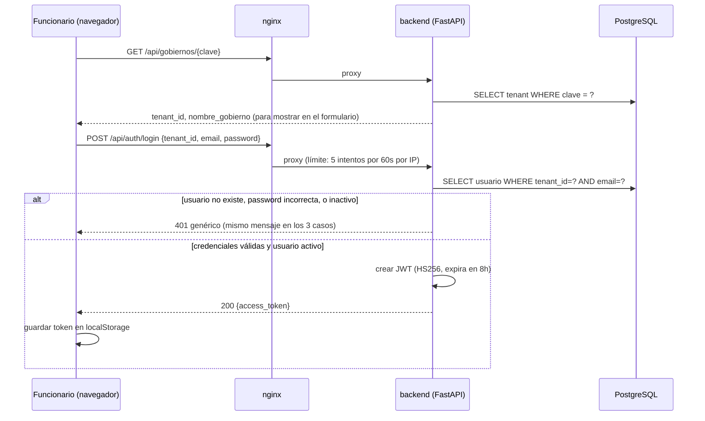
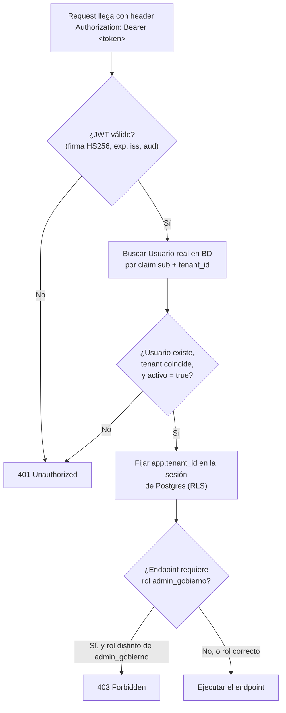
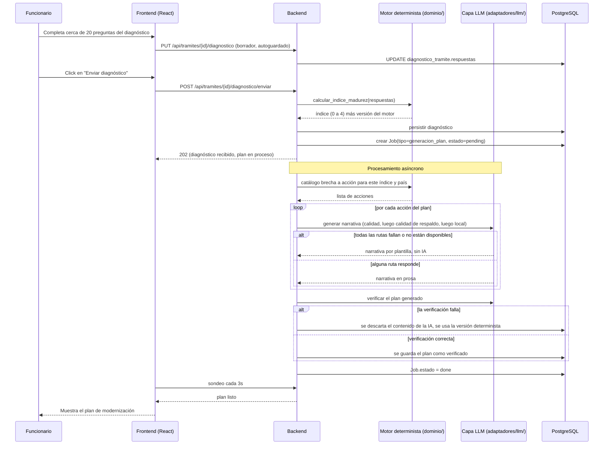
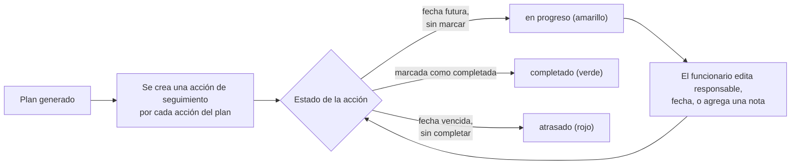

# Documentación Técnica Completa de DiagMuni

Versión 1.1 · 14 de septiembre de 2026 · Ricardo Flores Arredondo

Alcance: todo el repositorio (backend, frontend, infraestructura, CI/CD, y la documentación que ya existía en `docs/` y `entregables/`) tal como está en la rama principal a la fecha de arriba.

Este documento está pensado para dos tipos de lector a la vez. Si vienes de un rol no técnico (dirección, INAP, BID Lab), con leer el Resumen ejecutivo y el cierre de cada sección de riesgo alcanza. Si vas a mantener el código, el resto tiene el detalle técnico, con archivo y línea citados para que lo puedas comprobar tú mismo abriendo el repo.

Una aclaración sobre el método: casi todo lo que sigue viene de leer el código y la configuración reales, y cito la fuente donde corresponde. En los pocos puntos donde hago una lectura razonable pero no verificable al cien por ciento (una intención de diseño que el código no explica de forma literal, por ejemplo), lo digo de forma explícita en el propio párrafo, no con una etiqueta aparte.

---

## Índice

1. Resumen ejecutivo
2. Arquitectura general
3. Componentes del sistema
4. Flujos de proceso
5. Pseudocódigo de la lógica clave
6. Modelo de datos
7. Comentarios y calidad del código
8. Estado actual del proyecto
9. Ciberseguridad
10. Cumplimiento normativo y legal
11. Infraestructura y despliegue
12. Recomendaciones y hoja de ruta
13. Glosario

---

## 1. Resumen ejecutivo

DiagMuni es una plataforma web de código abierto que le permite a un gobierno local (un municipio en México, una intendencia en Uruguay) autodiagnosticar qué tan digitalizado está cada uno de sus trámites, en una escala de 0 a 4, y recibir a cambio un plan de modernización redactado a la medida: qué tecnología conviene adoptar, cuánto costaría aproximadamente, y qué personal y capacitación hacen falta. Así lo describen el `README.md` del repo y `docs/PRD.md`.

Está pensado para el funcionario público a cargo de modernización o de TI en el gobierno local, no para el ciudadano. Es un proyecto impulsado por el Laboratorio de Innovación Pública del INAP y presentado a la convocatoria GovTech Connect del BID Lab, dentro de la Red de Innovación Local (`docs/PRD.md`, `entregables/fase-1/teoria-de-cambio.md`).

El problema que atacamos es simple de explicar: hoy un gobierno local no tiene una forma barata y estandarizada de saber qué tan atrás está en digitalización, ni de decidir qué hacer primero con presupuesto limitado. La respuesta de DiagMuni es un motor de reglas determinista, no una caja negra de inteligencia artificial, que aplica normativa real (mexicana y uruguaya) a las respuestas del funcionario. Los modelos de lenguaje entran solo para redactar en prosa lo que el motor ya decidió; nunca deciden ellos qué acción recomendar. Esto se puede confirmar leyendo `backend/app/dominio/madurez.py`.

### Cómo está el proyecto hoy

| Dimensión | Situación |
|---|---|
| Madurez | En desarrollo activo, todavía sin una versión estable etiquetada, pero con las 6 pantallas y el backend funcionando de punta a punta. El propio README coincide: dice "en desarrollo activo, sin release todavía". |
| Antigüedad | Cerca de dos meses de vida (el primer commit es del 20 de julio de 2026), con actividad diaria bastante intensa desde entonces. |
| Pruebas | El backend mide 76% de cobertura en local, con un mínimo de 70% exigido en CI, y 57 archivos de test que incluyen integración real contra Postgres. El frontend tiene un test end to end que recorre las 6 pantallas contra el stack completo de Docker en cada PR, más pruebas unitarias puntuales. |
| Seguridad | Ya pasó por dos auditorías externas reales, identificadas en el propio historial de commits como "PentAGI" y "Strix", y sus hallazgos ya están corregidos. El escaneo estático (Bandit) no encuentra nada de severidad alta hoy. |
| Dependencias | El CI bloquea, no solo avisa, cualquier licencia GPL o AGPL y cualquier CVE conocido en cada pull request. |
| Continuidad | El equipo hoy son 2 personas (devdca y Ricardo Flores Arredondo) — Eduardo García Pacheco, que aportó 17 commits al historial (~26%), ya no está en el proyecto (actualizado el 2026-09-15). No es concentración dentro de un equipo más grande: es el tamaño real del equipo. Lo dejamos anotado en el propio `CODEOWNERS`. |
| Documentación previa | Ya existía bastante: PRD, TRD, esquema de datos, runbooks, matriz normativa. Este documento se apoya en eso y lo complementa, no lo repite. |

Cuatro riesgos merecen atención especial. Los tres primeros ya los teníamos señalados en el propio repositorio; aquí los dejo consolidados y verificados en un solo lugar.

Que el equipo completo sean 2 personas es un riesgo de continuidad del proyecto, no de seguridad del código en sí, pero conviene tenerlo presente porque el sistema maneja datos institucionales sensibles de gobiernos: la ausencia de cualquiera de las dos deja al proyecto con una sola persona activa, sin margen.

El limitador de intentos de login vive en memoria del proceso, sin persistencia. Para el volumen de un piloto es aceptable, y lo tenemos documentado como una limitación conocida, pero se reinicia cada vez que el proceso se reinicia.

La admisibilidad del proyecto ante GovTech Connect no está resuelta: la convocatoria podría exigir soluciones de código abierto con una comunidad ya activa, no un desarrollo nuevo, y DiagMuni se construyó desde cero. Es una decisión de producto y de financiamiento, no algo que se arregle con código.

Y hay artículos normativos concretos, sobre todo relacionados con pagos y con un decreto uruguayo, que todavía están pendientes de confirmar contra la fuente oficial. Ya lo tenemos anotado en `entregables/fase-1/matriz-normativa.md`.

---

## 2. Arquitectura general

### Cómo se despliega, a grandes rasgos



Esto está confirmado contra `docker-compose.yml`, `docker-compose.tls.yml`, `Caddyfile` y `nginx/nginx.conf`.

### Las capas de adentro del backend



Hay una regla arquitectónica que se puede leer directamente en el código y que vale la pena entender bien, porque es la decisión más importante de todo el proyecto: la carpeta `dominio/`, que es el motor determinista, jamás importa nada de `adaptadores/llm/`. Es al revés: la capa de inteligencia artificial consume al motor de reglas, nunca al contrario (`backend/app/adaptadores/llm/generador_plan.py`, línea 7, lo dice en un docstring, y el mismo principio se repite en `docs/TRD.md`). Gracias a eso, el índice de madurez y las recomendaciones normativas son completamente reproducibles: dos corridas con las mismas respuestas siempre dan el mismo resultado, y un modelo de lenguaje que alucine puede a lo sumo redactar mal una frase, nunca cambiar qué acción se recomienda.

El aislamiento entre gobiernos se resuelve con Row Level Security de PostgreSQL, forzada (`FORCE ROW LEVEL SECURITY`), no solo con un filtro `WHERE tenant_id = ...` puesto a mano en cada consulta del ORM. La diferencia importa: incluso si alguien olvida ese filtro en una consulta nueva, la propia base de datos rechaza devolver filas de otro tenant. Esto está en `backend/alembic/versions/0001_initial_schema.py` y en `backend/app/db/rls.py`.

Algunas otras decisiones que se ven en el código, y por qué las tomamos así:

| Decisión | Dónde se ve | Por qué importa |
|---|---|---|
| El motor de reglas vive en YAML y nunca usa `eval()` | `backend/app/dominio/reglas_loader.py`, líneas 50 a 65, con un parser propio | Cualquiera puede auditar un YAML sin saber programar, y no hay riesgo de que un criterio malicioso ejecute código |
| RLS de Postgres, no solo scoping en el ORM | `alembic/versions/0001_initial_schema.py` | Defensa real ante un bug de aislamiento entre gobiernos, algo crítico porque el dato es de terceros |
| JWT propio con PyJWT, en vez de un framework de terceros | `backend/app/core/security.py` | Control total sobre los claims, la expiración y el algoritmo usado para firmar |
| El LLM redacta, nunca decide | `backend/app/adaptadores/llm/generador_plan.py` | La recomendación normativa no puede cambiar entre ejecuciones solo porque el modelo varió |
| Fallback en cadena que nunca lanza una excepción | `generador_plan.py`, líneas 97 a 119 | El sistema siempre entrega un plan, incluso sin ningún proveedor de IA disponible |
| El backend nunca expone su puerto de forma directa | `docker-compose.yml`, líneas 26 y 27 (`expose`, no `ports`) | nginx queda como el único borde público, así que la superficie de ataque es más chica |
| Un plan generado por IA se marca como no verificado hasta pasar un chequeo | `app/models/plan_modernizacion.py`, `app/adaptadores/llm/verificador.py` | Evita que una alucinación del modelo se muestre como si fuera la recomendación final |

---

## 3. Componentes del sistema

| Componente | Para qué sirve | Entra | Sale | De qué depende adentro | De qué depende afuera |
|---|---|---|---|---|---|
| `backend/app/adaptadores/http` | Los routers de FastAPI, la capa de API REST | Requests HTTP con JWT | JSON validado con Pydantic | `aplicacion/`, `core/`, `db/` | FastAPI, Pydantic |
| `backend/app/dominio` | El motor determinista: calcula el índice de madurez, resuelve el catálogo de brecha a acción, y arma la narrativa cuando no hay IA disponible | Las respuestas del diagnóstico, y el YAML de reglas | Un índice de 0 a 4, acciones recomendadas, texto de plan "degradado" | Nada, es una capa pura sin base de datos ni HTTP | `pyyaml` |
| `backend/app/adaptadores/llm` | Conecta con Anthropic, DeepSeek u Ollama vía LiteLLM, con la cadena de fallback y una verificación posterior | La acción ya decidida por el motor, más el contexto del gobierno | La narrativa en prosa del plan | Consume `dominio/`, nunca al revés | `litellm`, y las tres APIs externas |
| `backend/app/aplicacion` | Orquesta los casos de uso: usuarios, jobs asíncronos, notificaciones, historial, sincronización con INEGI | Comandos que llegan de los routers | Cambios en la base, jobs encolados | `dominio/`, `db/`, `models/` | Ninguna |
| `backend/app/core` | Lo transversal: configuración, seguridad (JWT y Argon2), cifrado Fernet para las llaves que trae cada gobierno, límite de intentos, auditoría | Variables de entorno, requests | Tokens, hashes, logs de auditoría | Ninguna | `pyjwt`, `argon2-cffi`, `cryptography` |
| `backend/app/adaptadores/inegi` | Cliente para la API de Indicadores del INEGI, usada para prellenar la población del municipio | Clave geoestadística | Población total | Ninguna | La API de INEGI, vía `httpx` |
| `backend/app/adaptadores/pdf` | Arma el PDF descargable del plan | El contenido del plan, en JSON | Un archivo PDF | `dominio/` | `fpdf2` |
| `backend/app/models` y `alembic` | Los modelos de SQLAlchemy y las migraciones | Nada | El esquema de la base | Ninguna | SQLAlchemy, Alembic, Postgres |
| `frontend/src/pages` | Las 6 pantallas del producto más 3 rutas de administración (login, panel, diagnóstico, plan, seguimiento, perfil del gobierno, perfil propio, admin de usuarios, admin de salud de la IA) | Lo que hace el usuario | Llamadas a la API | `lib/*Api.ts` | React, React Router |
| `frontend/src/lib` | La capa de API tipada, un módulo por recurso, más el manejo de sesión y utilidades de dominio como el semáforo | Nada | Funciones tipadas para llamar a la API | Un envoltorio propio de `fetch` | TanStack Query |
| `frontend/src/components/ui` | Los componentes visuales base, al estilo de shadcn/ui, construidos sobre Radix UI y Tailwind | Nada | Componentes reutilizables | Ninguna | Radix UI, Tailwind |
| `nginx` | Sirve el build de React, hace de proxy hacia el backend, y pone las cabeceras de seguridad | Requests HTTP | Proxy o archivos estáticos | Ninguna | nginx 1.27 |
| Caddy (opcional) | TLS automático delante de nginx | Requests HTTPS | Proxy hacia nginx | Ninguna | Caddy 2 |
| `db-init` | Un script SQL que crea el rol de aplicación sin privilegios de superusuario, solo al crear el volumen de Postgres | Nada | Un rol de base de datos restringido | Ninguna | Postgres |

---

## 4. Flujos de proceso

### Iniciar sesión



Un detalle de seguridad que vale la pena resaltar: el mensaje de error es idéntico si el correo no existe, si la contraseña está mal, o si la cuenta está desactivada. Así un atacante no puede confirmar por prueba y error si un correo existe en el sistema. Se ve en `backend/app/adaptadores/http/auth.py` y en `deps.py`.

### Qué pasa en cada request, después de haber iniciado sesión



Algo que conviene entender bien: el backend nunca confía solo en lo que dice el JWT. En cada request vuelve a revisar contra la base de datos si el usuario sigue activo, así que desactivar a alguien surte efecto de inmediato, sin esperar las hasta 8 horas que dura su token. Está en `deps.py`, líneas 28 a 91.

### El corazón del producto: del diagnóstico al plan



Confirmado contra `backend/app/dominio/madurez.py`, `generador_plan.py`, `plan_job.py` y `frontend/src/pages/Diagnostico.tsx`, donde efectivamente el sondeo es cada 3 segundos.

### El semáforo de seguimiento



Visto en `backend/app/models/accion_seguimiento.py` y `frontend/src/pages/Seguimiento.tsx`.

---

## 5. Pseudocódigo de la lógica clave

### Cómo se calcula el índice de madurez

Esta versión simplifica lo que hace `backend/app/dominio/madurez.py`, para que se entienda sin abrir el código.

```
ALGORITMO CalcularIndiceMadurez(respuestas)
ENTRADA:  respuestas, un diccionario de unas 20 respuestas del cuestionario
SALIDA:   un índice de 0 a 4, o un error si ninguna regla del catálogo aplica

Las reglas vienen de indice_madurez.yaml y se evalúan en orden, de la más
específica a la más general. Gana la primera que aplica.

1.  SI respuestas.documentos_digitalizados = falso ENTONCES
2.      RETORNAR nivel 0                     // presencial en papel
3.  SI respuestas.motor_pagos = ninguno
       O respuestas.firma_electronica_habilitada = falso ENTONCES
4.      RETORNAR nivel máximo 2              // transaccional parcial
5.  SI respuestas.interoperabilidad = falso
       O respuestas.mecanismo_identidad = "ninguno" ENTONCES
6.      RETORNAR nivel máximo 3
7.  RETORNAR nivel 4                          // proactivo e interoperable
8.  SI ninguna regla anterior aplicó ENTONCES
9.      LANZAR ERROR("catálogo YAML incompleto para este caso")
```

Dos cosas de este código merecen explicarse aparte. Primero, cada diagnóstico guarda la versión del motor que lo generó (`VERSION_MOTOR`, en `madurez.py` línea 24), y si más adelante cambia una regla, los diagnósticos viejos no se recalculan solos con la regla nueva. Es intencional: sirve para que un diagnóstico se pueda auditar contra las reglas que de verdad estaban vigentes cuando se hizo. Segundo, el índice global de un gobierno es el promedio de solo los trámites que ya tienen diagnóstico. Uno sin diagnosticar no cuenta como cero ni se ignora en silencio dentro de una cuenta mal hecha, simplemente no entra al promedio; y si todavía no hay ninguno diagnosticado, el resultado es "sin dato", no un error ni un cero (`madurez.py`, líneas 105 a 118).

### Cómo funciona el respaldo de generación de narrativa vía IA

Basado en `generador_plan.py`, líneas 97 a 119.

```
ALGORITMO GenerarNarrativaAccion(accion, contextoGobierno, preferenciaTenant)
ENTRADA:  accion, ya decidida por el motor determinista (este algoritmo NUNCA
          decide eso)
          contextoGobierno, los datos institucionales del tenant
          preferenciaTenant, un proveedor propio que el gobierno haya
          configurado (opcional)
SALIDA:   texto en prosa explicando la acción al funcionario

1.  rutas ← ResolverCadenaDeRutas(preferenciaTenant)
    // por ejemplo, con proveedor "anthropic": calidad, calidad de respaldo, local

2.  PARA CADA ruta EN rutas:
3.      SI NO EstaDisponible(ruta) ENTONCES
4.          CONTINUAR con la siguiente ruta
5.      INTENTAR
6.          respuesta ← LlamarLLM(ruta, prompt)
7.          RETORNAR respuesta
8.      CAPTURAR cualquier excepción (timeout, red, error de API, respuesta vacía)
9.          // se pasa en silencio a la siguiente ruta, sin relanzar el error
10. RETORNAR NarrativaPorPlantilla(accion)    // siempre disponible, sin IA
```

El prompt le pide de forma explícita al modelo que no invente hechos, normativa ni pasos que no vengan en la información que se le da (`generador_plan.py`, líneas 31 a 50). Es una restricción real, no cosmética: el LLM redacta sobre una decisión que el motor ya tomó, y nunca elige la acción ni cita normativa por su cuenta.

### Cómo se aísla cada gobierno en cada request

Basado en `backend/app/db/rls.py` y `deps.py`.

```
ALGORITMO ObtenerSesionDeBaseDeDatos(usuarioAutenticado)
ENTRADA:  el usuario ya validado a partir del JWT
SALIDA:   una sesión donde cualquier consulta queda filtrada de forma
          automática a las filas de este tenant

1.  sesion ← AbrirSesionSQLAlchemy()
2.  sesion.ejecutar("SELECT set_config('app.tenant_id', :id, true)",
                      id = usuarioAutenticado.tenant_id)
3.  RETORNAR sesion

A partir de aquí es Postgres, no el código Python, quien rechaza cualquier
fila cuyo tenant_id no coincida, en cualquier tabla con FORCE ROW LEVEL
SECURITY, incluso si alguien olvida escribir el WHERE a mano.
```

Hay una advertencia real, dejada a propósito en el propio código: si una misma sesión hace más de un commit, el contexto de tenant hay que volver a fijarlo después de cada uno, porque se reinicia con la transacción. Está señalada para los jobs de larga duración, en `plan_job.py`.

---

## 6. Modelo de datos

```mermaid
erDiagram
    TENANT ||--o{ USUARIO : tiene
    TENANT ||--|| CONTEXTO_INSTITUCIONAL : tiene
    TENANT ||--o{ TRAMITE : tiene
    TRAMITE ||--o| DIAGNOSTICO_TRAMITE : tiene
    DIAGNOSTICO_TRAMITE ||--o{ PLAN_MODERNIZACION : genera
    PLAN_MODERNIZACION ||--o{ ACCION_SEGUIMIENTO : contiene
    ACCION_SEGUIMIENTO ||--o{ NOTA_SEGUIMIENTO : tiene
    TRAMITE ||--o{ EVENTO_HISTORIAL : registra
    TRAMITE ||--o{ NOTIFICACION : genera
    ACCION_SEGUIMIENTO ||--o{ NOTIFICACION : genera
    DIAGNOSTICO_TRAMITE ||--o{ JOB : dispara
    TENANT ||--o{ HISTORIAL_INDICE_GLOBAL : registra
    TRAMITE ||--o{ CORRECCION_IA : genera
    USUARIO ||--o{ CORRECCION_IA : crea
    USUARIO ||--o{ NOTA_SEGUIMIENTO : crea

    TENANT {
        uuid id PK
        string nombre
        string clave UK
        enum pais "mx | uy"
        enum nivel_gobierno "municipal | estatal | federal"
        string clave_geoestadistica
        text deepseek_api_key_cifrada
        text anthropic_api_key_cifrada
        string proveedor_llm_preferido
    }
    USUARIO {
        uuid id PK
        uuid tenant_id FK
        string email "unique con tenant_id"
        string password_hash "argon2"
        enum rol "funcionario | admin_gobierno"
        bool activo
        timestamp ultimo_login_en
    }
    CONTEXTO_INSTITUCIONAL {
        uuid tenant_id PK_FK "1 a 1 con tenant"
        int poblacion_total
        numeric presupuesto_tic_anual
        numeric presupuesto_total_anual
        bool area_tic_existe
        enum conectividad
        bool normativa_local_emitida
        bool agenda_simplificacion_publicada
    }
    TRAMITE {
        uuid id PK
        uuid tenant_id FK
        string nombre "unique con tenant_id"
        enum estado "sin_iniciar..plan_listo"
        string tipo "catálogo YAML"
        timestamp archivado_en "nullable"
    }
    DIAGNOSTICO_TRAMITE {
        uuid id PK
        uuid tramite_id FK
        uuid tenant_id FK "denormalizado"
        jsonb respuestas
        smallint indice_madurez "0-4, nullable"
        string version_motor
    }
    PLAN_MODERNIZACION {
        uuid id PK
        uuid diagnostico_tramite_id FK
        int version "nunca se borra"
        enum modo "llm | degradado"
        jsonb contenido
        bool verificado
    }
    ACCION_SEGUIMIENTO {
        uuid id PK
        uuid plan_modernizacion_id FK
        string responsable
        date fecha_objetivo
        enum estado_semaforo "completado | en_progreso | atrasado"
    }
    JOB {
        uuid id PK
        enum tipo "generacion_plan"
        enum estado "pending | running | done | failed"
        smallint intentos
        jsonb resultado
    }
    HISTORIAL_INDICE_GLOBAL {
        uuid id PK
        float indice_global
        int nivel_0_conteo
        int nivel_4_conteo
    }
    CORRECCION_IA {
        uuid id PK
        uuid tramite_id FK "nullable"
        text entrada_llm
        text salida_llm
        text correccion
        string ruta_llm "nullable"
    }
    EVENTO_HISTORIAL {
        uuid id PK
        uuid tramite_id FK
        uuid usuario_id "sin FK, a propósito"
        string tipo
        jsonb metadatos
    }
```

Son 13 modelos en `backend/app/models/`, construidos a lo largo de 20 migraciones en `backend/alembic/versions/`.

### Qué significan los campos que más importan

| Tabla | Campo | Qué significa |
|---|---|---|
| tenant | clave | El identificador legible con el que el funcionario encuentra a su gobierno en el login, distinto del UUID interno |
| tenant | nivel_gobierno | Municipal, estatal o federal; sostiene la expansión del proyecto a más de un orden de gobierno |
| tenant | las columnas cifradas de API key | La credencial del propio gobierno para su proveedor de IA, cifrada con Fernet antes de tocar disco |
| usuario | rol | Solo dos valores posibles: funcionario, para uso normal, y admin_gobierno, para gestionar usuarios y la configuración de IA |
| usuario | activo | Alta o baja reversible sin borrar el registro, así se puede reactivar sin perder historial |
| tramite | estado | Una máquina de estados: sin iniciar, en progreso, diagnosticado, generando el plan, plan listo |
| tramite | archivado_en | Archivar y desarchivar es reversible; borrar de verdad solo se permite antes de completar un diagnóstico |
| diagnostico_tramite | respuestas | Incluye una clave de aclaraciones en texto libre, que alimenta al clasificador de IA que asiste la captura |
| diagnostico_tramite | version_motor | Ancla el diagnóstico a la versión exacta de las reglas que lo generaron |
| plan_modernizacion | verificado | Si es falso, el frontend no debería mostrar ese plan; es el candado contra alucinaciones sin revisar |
| plan_modernizacion | version | Sube en cada regeneración; las versiones viejas nunca se borran, así se pueden comparar |
| historial_indice_global | los conteos por nivel | La distribución de madurez de todo el gobierno en un momento dado, para graficar la tendencia |
| correccion_ia | toda la tabla | Una bitácora de correcciones humanas sobre lo que escribió la IA, pensada como insumo para un futuro mecanismo de aprendizaje por ejemplos que todavía no existe |

Todas las tablas con `tenant_id` (o sea, todas menos `tenant`) tienen activada la seguridad a nivel de fila, y forzada, con la misma política: solo se ven las filas donde el tenant coincide con el de la sesión actual (`alembic/versions/0001_initial_schema.py`). Que esté forzada es la parte que importa: sin eso, la seguridad no se aplicaría al propio rol que usa la aplicación, y quedaría un hueco.

---

## 7. Comentarios y calidad del código

### Backend

Los docstrings y comentarios son inusualmente extensos, y no solo dicen qué hace una función sino por qué la decidimos así, muchas veces citando el hallazgo concreto de una auditoría externa con fecha. Se ve en `config.py`, `nginx.conf`, `requirements.txt`, `rls.py` y `generador_plan.py`. Es una fortaleza para quien tenga que dar mantenimiento después, aunque alarga algunos archivos.

Hay un solo TODO en todo `backend/app/` (`app/aplicacion/bitacora_correcciones.py`, líneas 19 a 25), y está anotado como bloqueado por falta de un dato, no por una decisión de diseño pendiente. No hay ni un FIXME, XXX o HACK en todo el backend.

La nomenclatura es consistente en español para el dominio del negocio, con snake_case y PascalCase estándar de Python. La duplicación que existe (por ejemplo, la estructura repetida de aislamiento por tenant y timestamps entre modelos) es intencional y está documentada.

`ruff` y `mypy` corren en el CI como candado duro, no como sugerencia: un PR con el lint roto simplemente no pasa. Eso sí, `mypy` no exige tipado estricto en el cien por ciento de las funciones, así que hay margen para subirlo con el tiempo.

### Frontend

El `tsconfig.json` tiene `strict: true`, y no hay ni una sola ocurrencia de `any` en todo `src/`, algo poco común para un proyecto de este tamaño. Los comentarios también son ricos en contexto de producto y de seguridad, con referencias a hallazgos por identificador. No hay ningún TODO real (la única coincidencia al buscar la palabra es una constante que en español significa "todos", no una marca de pendiente).

La accesibilidad está bastante cuidada: uso consistente de `aria-hidden`, `role="alert"`, `aria-invalid` y `aria-label`, con comentarios que explican por qué cada uno está donde está.

Dos cosas para mejorar, ninguna urgente: `Diagnostico.tsx` (1246 líneas) y `GobiernoPerfil.tsx` (1152 líneas) son archivos grandes, con un `useState` por cada campo en vez de un estado más organizado, algo que va a costar más mantener si se agregan más campos. Y el patrón visual de un campo booleano con RadioGroup está repetido en al menos cuatro lugares entre esos dos archivos, sin un componente compartido: es un candidato claro para extraer.

### Algunas prácticas que faltan o convendría sumar

| Qué falta | Dónde | Qué se podría hacer |
|---|---|---|
| No hay una carpeta de hooks ni un estado normalizado para los formularios grandes | frontend | Un hook reutilizable de autoguardado por campo |
| El componente de campo booleano está duplicado | frontend | Uno solo, compartido, en `components/ui/` |
| `mypy` no exige tipado estricto en todas las funciones | backend | Subirlo poco a poco, empezando por `core/` y `dominio/` |
| El limitador de intentos vive solo en memoria | backend | Aceptable hoy; documentar el límite explícitamente en el runbook de producción |

---

## 8. Estado actual del proyecto

| Qué | Cómo está | Dónde se ve |
|---|---|---|
| Motor determinista de madurez | Completo, con pruebas | `dominio/madurez.py`, `test_engine_madurez.py` |
| Catálogo de brecha a acción, para México y Uruguay, tres órdenes de gobierno | Completo, en expansión activa | `reglas/`, 29 YAML municipales más subcarpetas estatal y federal |
| La API REST del backend, unos 35 endpoints | Completa, con pruebas | Sección 3 de este documento |
| La capa de IA con su cadena de respaldo | Completa, probada contra un Ollama real | `test_generador_plan_ollama_real.py` |
| Las 6 pantallas del frontend | Completas, con un test end to end de punta a punta | `flujo-completo.spec.ts` |
| Roles y permisos | Completo desde la migración 0011 | `docs/backend-schema.md` ya lo da por resuelto |
| Sincronización de población con INEGI | Completa | `test_cliente_inegi.py`, `test_sincronizacion_inegi.py` |
| Cifrado de los backups | Mecanismo listo (GPG), falta generar la clave real y decidir su custodia | `docs/runbook-backup.md` |
| Saber qué ruta de IA generó cada clasificación | Todavía no, y está documentado por qué | Es el único TODO real del proyecto |
| TLS real en producción, con Caddy | Presente, pero sin probar todavía contra un dominio real | `docs/runbook-despliegue.md` |
| Cuántos días se guardan los backups | Solo un ejemplo, sin confirmar | `docs/runbook-backup.md` |
| Varios servidores o alta disponibilidad | Fuera de alcance por ahora | El propio runbook lo dice |
| Portal ciudadano o pasarela de pagos propia | Fuera de alcance del producto, a propósito | `docs/PRD.md` |

Sobre las pruebas: el backend mide 76% de cobertura en local sin Postgres (medido el 10 de septiembre de 2026), con un mínimo de 70% exigido en CI; con Postgres real corriendo en CI, la cifra documentada sube a 89%. El frontend no tiene un número único de cobertura, pero sí un test que recorre las 6 pantallas completas contra el stack Docker real en cada PR, además de un test específico del modo con IA real que se salta solo si Ollama no está disponible.

La deuda técnica identificada es corta: el campo que todavía no guarda qué ruta de IA respondió (impacto bajo, solo bloquea un mecanismo futuro), la duplicación de componentes de formulario en el frontend (impacto bajo o medio), el limitador de intentos sin persistencia (impacto medio si el proceso se reinicia seguido), la clave real de cifrado de backups pendiente de generar (impacto alto mientras no exista), y el bus factor de dos personas (impacto alto para la continuidad, aunque no es deuda de código).

No se encontraron dependencias obviamente obsoletas. Mantenemos un proceso activo de actualización por CVE, con comentarios fechados dentro de `requirements.txt` y un candado de auditoría de paquetes en el CI. Más detalle en la sección de seguridad, con la recomendación de no darlo por resuelto para siempre.

---

## 9. Ciberseguridad

Para quien no viene del lado técnico: el proyecto ya pasó por dos auditorías de seguridad externas reales, y ambas ya tienen sus hallazgos corregidos y documentados en el código. El escaneo automatizado no encuentra nada de severidad alta hoy. El riesgo más importante que queda no es técnico, es que solo dos personas mantienen todo esto.

### Repaso contra el OWASP Top 10

| Categoría | Cómo está |
|---|---|
| Control de acceso roto | Bien cubierto: dos roles, se revalida si el usuario sigue activo en cada request y no solo al iniciar sesión, y la seguridad a nivel de fila de Postgres como respaldo adicional |
| Fallas criptográficas | Argon2 para contraseñas, Fernet para las llaves de IA que trae cada gobierno, y JWT firmado solo con HS256, de forma fija, lo que evita la confusión de algoritmo del CVE-2026-48526 que se cita en el propio código |
| Inyección | No hay SQL armado con texto interpolado en ningún lado; todo pasa por parámetros de SQLAlchemy, incluso el ajuste del tenant en cada sesión. El motor de reglas interpreta sus criterios sin `eval()` |
| Diseño inseguro | El LLM nunca decide reglas de negocio, y un plan generado por IA necesita pasar una verificación antes de poder mostrarse |
| Configuración insegura | Si falta un secreto real en producción, el backend simplemente no arranca, en vez de arrancar con un valor de ejemplo. Las cabeceras de seguridad están completas en nginx |
| Componentes vulnerables | El CI bloquea licencias problemáticas y CVEs conocidos en cada PR. Bandit no encuentra nada de severidad alta; lo de severidad media es prácticamente un falso positivo en un test de integración, y casi todo lo de severidad baja son simples `assert` dentro de pruebas |
| Fallas de autenticación | Límite de intentos en el login, mensajes de error idénticos para no dejar adivinar si una cuenta existe, y contraseñas de arranque con bastante entropía |
| Integridad de software y datos | El CI fija cada acción de GitHub por su hash, no por una etiqueta que alguien pueda cambiar después; las imágenes de Docker también están fijadas por su hash |
| Registro y monitoreo | Hay auditoría de eventos clave en formato estructurado, pero no hay todavía agregación centralizada ni alertas; es una limitación que aceptamos para el tamaño actual del equipo |
| Falsificación de peticiones del servidor | La superficie es chica: el único cliente HTTP hacia afuera que no sea un proveedor de IA es el de INEGI, con una URL fija que no depende de lo que escriba el usuario |

### Lo que ya corregimos, de auditorías externas reales

Una auditoría identificada como PentAGI, del 19 de agosto de 2026, encontró un problema real: la regla de nginx que decidía en qué confiar para identificar la IP de origen aceptaba todo un rango enorme de direcciones internas de Docker, así que cualquier contenedor vecino podía falsificar su IP y saltarse el límite de intentos de login. Lo probamos en vivo: doce de doce intentos pasaron sin bloquearse. Ya está corregido, fijando esa confianza a la IP exacta del contenedor que hace de borde (`nginx/nginx.conf`, líneas 13 a 31, con el detalle completo en un comentario).

Otra auditoría, de una herramienta llamada Strix, el 7 de septiembre de 2026, encontró trece hallazgos en total, entre ellos cabeceras de seguridad que faltaban y la ausencia del límite de intentos que se acaba de mencionar. Todos están corregidos y se pueden verificar en `nginx.conf` y `rate_limit.py`.

### Dependencias y CVEs conocidos

Dejamos, dentro de los comentarios de `requirements.txt`, el registro de una investigación real de vulnerabilidades:

| Paquete | Versión | Qué se investigó | Conclusión |
|---|---|---|---|
| pyjwt | 2.13.0 | Varios CVEs de 2026 relacionados con validación de cabeceras y confusión de algoritmo | Corregidos en esta versión; el proyecto de todas formas solo usa HS256, así que el vector directo no aplicaba, pero se actualizó por ser la librería que firma la autenticación |
| litellm | 1.94.0 | Un compromiso real de PyPI en marzo de 2026, en dos versiones muy anteriores, con credenciales de CI robadas | No afecta a esta versión, mucho más reciente |
| pypdf, solo en desarrollo | 6.16.1 | 41 avisos abiertos que se habían reportado en una versión anterior | Cero en la versión que se usa aquí, y de todas formas no llega a la imagen de producción |

Esta tabla refleja el trabajo que ya hicimos, y es evidencia de buena práctica. Pero como la fecha de corte es cuando fijamos cada versión, conviene repetir esta revisión de forma periódica en vez de darla por cerrada para siempre, sobre todo para `starlette` y `litellm`, que son las que más superficie de ataque tienen.

### Cómo manejamos los datos sensibles

Las contraseñas nunca se guardan en texto plano ni se registran en logs. Las llaves de IA de cada gobierno se cifran en reposo y nunca se devuelven en claro por la API, solo un valor que indica si ya hay una configurada. El JWT se guarda en `localStorage` del navegador, no en una cookie protegida, pero eso está mitigado por una política de seguridad de contenido estricta y por la ausencia total de formas de inyectar HTML sin escapar en el frontend.

El punto que más pesa aquí es el backup: el archivo que produce `pg_dump` queda sin cifrar en el disco del servidor por defecto, y contiene el hash de las contraseñas de todos los funcionarios además de los datos reales de diagnóstico de cada gobierno. Ya dejamos listo, en `docs/runbook-backup.md`, el mecanismo para cifrarlo con GPG (probado de punta a punta con una clave desechable), pero el riesgo sigue vigente hoy porque todavía no existe una clave real ni una decisión tomada sobre quién la resguarda. Es el hallazgo más urgente de cerrar antes de un despliegue con datos de gobiernos reales.

### Riesgos de seguridad, resumidos

| Riesgo | Qué tan grave | Cómo está |
|---|---|---|
| El backup queda sin cifrar en disco hasta que exista una clave GPG real | Alto | Mecanismo listo y probado en el runbook; falta generar la clave y decidir su custodia |
| El limitador de intentos vive solo en memoria | Medio | Aceptado como limitación conocida para el volumen actual |
| No hay agregación ni alertas centralizadas de logs | Medio | Aceptado, es cuestión de tamaño del equipo por ahora |
| Los CVEs de dependencias necesitan revisión continua, no una sola vez | Bajo | Mitigado por el CI, conviene reforzar la frecuencia |
| Confusión de algoritmo JWT, fuerza bruta, cabeceras faltantes | No aplica | Ya corregido |

---

## 10. Cumplimiento normativo y legal

Esta sección es una orientación técnica preliminar, basada en la investigación normativa que ya habíamos hecho (`docs/anexo_legislacion_mx.md`, `docs/anexo_legislacion_uy.md`, `entregables/fase-1/matriz-normativa.md`). No reemplaza una asesoría legal formal.

DiagMuni maneja datos personales de funcionarios públicos (nombre, correo, hash de contraseña), datos institucionales del gobierno (presupuestos, infraestructura de TI, incidentes de ciberseguridad que el propio gobierno reporta), y, de forma indirecta, dentro de las respuestas de texto libre del diagnóstico, podría llegar a aparecer alguna mención incidental a un tercero si un funcionario la escribe. El sistema no está diseñado para guardar datos de ciudadanos de forma directa, pero ese campo de texto libre queda abierto a que alguien escriba algo ahí; esto último es una lectura mía, no algo que el código prohíba de forma explícita.

En México, la norma central es la Ley Nacional para Eliminar Trámites Burocráticos, de julio de 2025, con obligaciones municipales concretas de inventario de trámites y de un portal ciudadano único. También aplica la nueva ley de protección de datos personales en sujetos obligados, que sustituye al marco que existía antes de que se extinguiera el INAI, además de la Ley General de Archivos y las leyes de firma electrónica. Ya hicimos esta investigación y marcamos nuestro nivel de certeza artículo por artículo.

En Uruguay aplica la ley de datos personales, con un delegado de protección de datos obligatorio, la ley de trámites en línea, la de firma electrónica, y la que da preferencia al software libre y alcanza a los gobiernos departamentales. Un dato que ya habíamos identificado y que vale la pena repetir: la mayoría de los "trámites municipales" en Uruguay son en realidad departamentales, una distinción real de competencias, no un detalle menor, porque cambia a quién le corresponde institucionalmente el diagnóstico.

Ya habíamos marcado como pendientes de confirmar en la fuente oficial: los artículos sobre el motor de pagos de la nueva ley mexicana, la circular de Banxico sobre CoDi, y un decreto uruguayo específico. Es justo el tipo de brecha que hay que cerrar antes de un despliegue real con un gobierno, y ya está anotada, no es un hallazgo nuevo de este documento.

Lo que sí noto de nuevo al revisar esto ahora: no tenemos un aviso de privacidad dirigido a los funcionarios que se registran en el sistema, algo que normalmente exige la normativa de datos personales incluso para empleados públicos; no tenemos una política de retención de datos formalizada más allá del ejemplo de "siete días" para los backups, sin confirmar; y los logs de auditoría cubren eventos de negocio (se envió un diagnóstico, se borró un trámite) pero no está claro si califican como el tipo de log de acceso a datos personales que la normativa podría exigir, porque hoy registran qué pasó, no quién vio qué dato personal y cuándo.

| Riesgo | Qué tan grave | Cómo está |
|---|---|---|
| Artículos normativos clave sin confirmar en fuente oficial | Media a alta para una certificación formal, no para el piloto | Ya identificado, pendiente |
| No hay aviso de privacidad para los usuarios | Media | Nuevo, aportado aquí |
| No hay política de retención de datos formalizada | Baja a media | Nuevo, aportado aquí |
| El log de auditoría no está pensado como log de acceso a datos personales | Baja | Aportado aquí; vale revisar si aplica según cuánto dato personal se maneje en la práctica |

---

## 11. Infraestructura y despliegue

Todo corre con Docker Compose sobre un único servidor (un VPS de 2 vCPU y 2 GB de RAM como piso mínimo documentado). Los servicios son Postgres 16 con un rol de aplicación sin privilegios de superusuario, el backend con su puerto interno que nunca se publica de forma directa, nginx como el único borde HTTP publicado, y Ollama como opción que no arranca por defecto. La variante con TLS agrega Caddy, con Let's Encrypt automático, en una red de Docker aparte con IP fija.

El pipeline de CI tiene seis pasos encadenados: primero revisa que no se filtre nada interno de desarrollo al repositorio público; luego corre lint, tipado, migraciones reales, pruebas con cobertura, y los candados de licencias y de CVEs sobre el backend; después lo mismo, adaptado, sobre el frontend; luego levanta el stack completo de Docker y corre las pruebas end to end contra él; después construye las imágenes; y por último despliega una vista previa a Cloudflare Pages en cada pull request, si los secretos necesarios ya están configurados.

Dos variables merecen mención aparte: si en producción falta el secreto de JWT o la llave de cifrado del tenant, el backend directamente no arranca, por diseño, para evitar el error clásico de dejar puesto el valor de ejemplo. La cadena de conexión que usa el backend en su día a día es la del rol restringido; la que tiene privilegios de superusuario solo se usa para correr migraciones.

| Riesgo | Qué tan grave | Cómo está |
|---|---|---|
| No hay soporte para varios servidores ni alta disponibilidad | Media, aceptable para un piloto de un solo gobierno | Documentado como fuera de alcance por ahora |
| El flujo de TLS con Caddy todavía no se probó contra un dominio real | Media | Pendiente antes del primer despliegue real |
| El backup no queda cifrado hasta que exista una clave GPG real | Alta, ver la sección de seguridad | Mecanismo listo, falta la clave y su custodia |

---

## 12. Recomendaciones y hoja de ruta

Lo más rápido de resolver, con buen impacto:

1. Generar la clave GPG real para los backups y decidir quién resguarda la privada. El mecanismo de cifrado ya está listo y probado en el runbook (agregado el 14 de septiembre) — solo falta activarlo. Sigue siendo el punto más urgente hasta que se haga.
2. Redactar un aviso de privacidad para los usuarios del sistema. Es poco esfuerzo legal y cierra una brecha real.
3. Sacar el componente de campo booleano duplicado del frontend a un solo lugar compartido.
4. Terminar de propagar qué ruta de IA generó cada clasificación, algo que ya dejamos acotado.

A mediano plazo:

5. Formalizar una política de retención de datos y documentarla junto al runbook de backup.
6. Evaluar mover el limitador de intentos a un almacén persistente, como Redis o una tabla de Postgres, si el tráfico crece más allá de un piloto. Hoy no es un defecto, pero conviene fijar en qué momento dejaría de ser aceptable.
7. Cerrar las verificaciones normativas que todavía están pendientes contra la fuente oficial, antes de certificar el motor de reglas frente a un gobierno real.
8. Probar de verdad, contra un dominio productivo, el flujo de TLS con Caddy, y actualizar el runbook una vez confirmado.

A más largo plazo:

9. Bajar el riesgo de que solo dos personas concentren el conocimiento del proyecto: documentar las decisiones de arquitectura de forma más explícita (ya hay material rico disperso en comentarios) y considerar sumar a alguien más como responsable de revisión.
10. Si crece el número de gobiernos activos, evaluar una capa de observabilidad más robusta, con agregación de logs y alertas.
11. Resolver con la Red de Innovación Local y el BID Lab el tema de admisibilidad ante GovTech Connect, que ya señalamos como una decisión pendiente de producto y financiamiento.

---

## 13. Glosario

| Término | Qué significa |
|---|---|
| Tenant | Un gobierno local dentro de la plataforma, aislado de los demás |
| RLS (seguridad a nivel de fila) | El mecanismo de Postgres que filtra filas automáticamente según una regla, aquí el tenant, a nivel del propio motor de base de datos |
| BYOK (trae tu propia llave) | Cada gobierno puede usar su propia credencial de un proveedor de IA en vez de una compartida |
| Motor determinista | El código que calcula el índice de madurez y decide qué acciones recomendar; siempre da el mismo resultado ante las mismas respuestas |
| Índice de madurez | Un número de 0 (presencial en papel) a 4 (proactivo e interoperable) que resume qué tan digitalizado está un trámite |
| Plan de modernización | El documento que se genera con las acciones recomendadas para subir ese índice |
| Modo degradado | Cuando ningún proveedor de IA está disponible, el plan se genera igual, con texto de plantilla |
| LiteLLM | La librería que abstrae la llamada a distintos proveedores de modelos de lenguaje bajo una misma interfaz |
| JWT | El token firmado que prueba la identidad del usuario en cada request, sin mantener sesión en el servidor |
| Argon2 | El algoritmo usado para nunca guardar contraseñas en texto plano |
| Fernet | El esquema de cifrado usado para las llaves de IA que trae cada gobierno |
| LNETB | La Ley Nacional para Eliminar Trámites Burocráticos de México, de 2025 |
| RIL | La Red de Innovación Local del BID Lab |

---

Armé esta documentación explorando el código real del repositorio y lo que ya teníamos escrito en `docs/` y `entregables/`, citando archivo y línea siempre que fue posible. En ningún momento leí el archivo `.env` real con secretos vigentes, solo `.env.example`. Donde una afirmación depende de investigación normativa o de CVEs que ya habíamos documentado dentro del código, la cito como tal, y recomiendo repetir esa verificación de forma periódica en vez de darla por resuelta para siempre.
